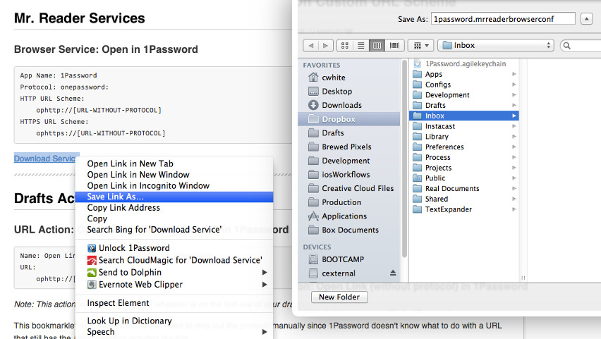
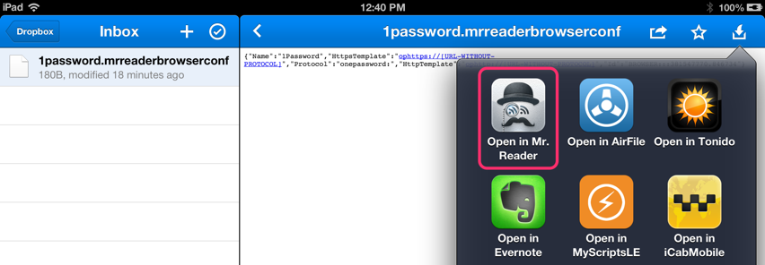
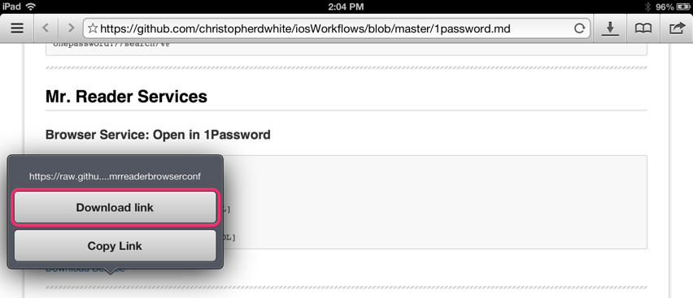
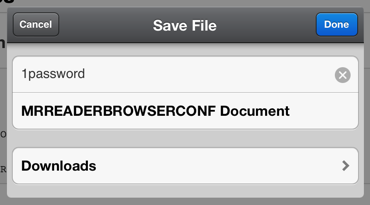
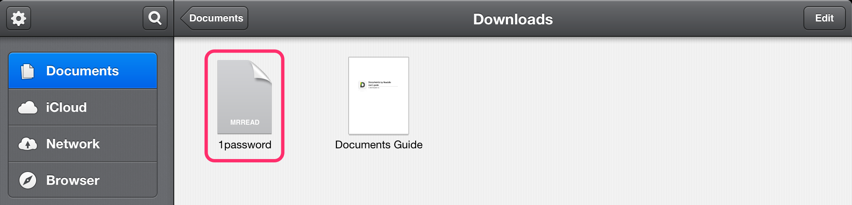
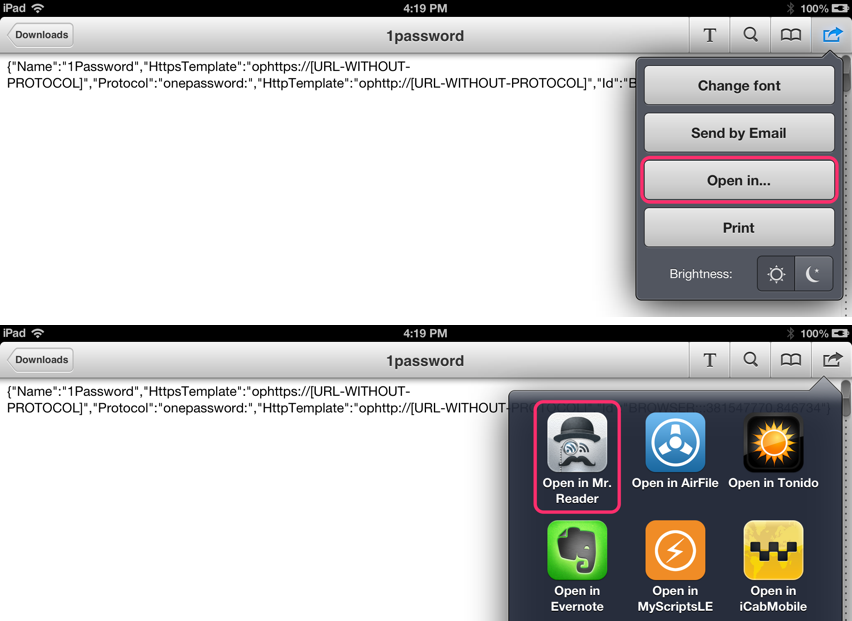

# General Guide and Notes

Like this whole project this guide is a work in progress, I'll be filling in more as details as I go but feel free to contact me if you run into any trouble.

## Table of Contents
1. [Verbose Naming](#verbose-naming)
1. [Installing Drafts Actions](#installing-drafts-actions)
1. [Installing Mr. Reader Browser and Other App Servicess](#installing-mr-reader-browser-and-other-app-services)
    1. [Use Dropbox](#use-dropbox)
    1. [Use Documents by Readdle](#use-documents-by-readdle)
    1. [Technical Complications](#technical-complications)
1. [Bookmarklet Limitations for Selected Text in Different Browsers](#bookmarklet-limitations-for-selected-text-in-different-browsers)
    1. [Safari (iPad)](#safari-ipad)
    1. [Safari (iPhone)](#safari-iphone)
    1. [Google Chrome](#google-chrome)
    1. [Dolphin](#dolphin)
    1. [iCab Mobile (iPad)](#icab-mobile-ipad)
    1. [iCab Mobile (iPhone)](#icab-mobile-iphone)
    1. [Mercury](#mercury)

---

## Verbose Naming

One thing you may notice about these actions is that they often have extra long names like *Search 1Password for...? If Empty Search for Domain* or *Read Link Later in Pinbook (Private).* The intention is to be descriptive for you to choose which action to adopt but I encourage you to shorten them for your workflow. You might choose *1Password* and *Read Later in Pinbook* for instance as better names in practice.

---

## Installing Drafts Actions

~~To install Drafts actions simple browser the workflow page with the action you want in a browser on your iOS device and tap **Install Action.** Drafts must already be installed.~~

For some reason, this isn't working as an link, when you tap on it, nothing happens. However, if you copy and paste the URL into the address bar it works as expected. I'm going to contact the developer and will update the guide and workflows once I've received a reply.

[Table of Contents ↩](#table-of-contents)

---

## Installing Mr. Reader Browser and Other App Services

Installing Mr. Reader services is fairly easy but takes a couple of steps. Unlike Mr. Reader's official [3rd party apps page](http://www.curioustimes.de/mrreader/supported-apps/index.html) you can't just open the link in Safari on your iPad for GitHub related  ([technical reasons](#technical-complications)).

What you need to do is download the files into an iPad app that will let you choose how you want to open the file so you can then specify Mr. Reader. Mr. Reader must be installed before you can open the file.

I've outlined two ways to do it, hopefully you can use them as a starting point to adapt to your most convenient workflow.

### Use Dropbox

1. Save the **'Download Service'** file you want to somewhere in your [Dropbox](http://www.dropbox.com/) on a Desktop computer.  
    
1. Open [Dropbox on your iPad](https://itunes.apple.com/us/app/dropbox/id327630330?mt=8) and select the file.
1. Tap on the *Open In* button and then select **Open in Mr. Reader.**  
    

### Use Documents by Readdle

1. Open the page with the Mr. Reader service you want in [Document's](https://itunes.apple.com/us/app/documents-by-readdle/id364901807?mt=8) browser
2. Tap and hold the **'Download Service'** file you want and choose **Download Link.**  
    
3. Save the file by tapping **Done.**  
    
4. Find and select the file in your **Documents** section. It will be named after the service you downloaded and the icon will have 'MRREAD' on it.  
    
5. Tap on the *Share* button, then the **Open In** item and finally **Open in Mr. Reader**  
    

### Technical Complications

Unlike Mr. Reader's official [3rd party apps page](http://www.curioustimes.de/mrreader/supported-apps/index.html) if you try to open a .mrreaderbrowserconf or .mrreaderappconf file in a browser on an iOS app you'll see the plaintext code contained in the file.

I contacted the developer to see if he could provide any assistance determining what was different between GitHub and his site. He provided this responce:

> I had the same problem (raw data; plain text) on my web server. The only solution that I've found was to add mime types for the file extensions. I'm using Apache and added the following to my listen.conf entry:
> 
> AddType application/x-mrreader .mrreadertheme
> AddType application/x-mrreader-browser-configuration .mrreaderbrowserconf
> AddType application/x-mrreader-app-configuration .mrreaderappconf
> AddType application/x-mrreader-mail-configuration .mrreadermailconf

Unfortionately, it [isn't possible](http://twitter.com/holman/status/302487837088051200) to setup custom MIME Types on GitHub. Rather than trying to host the files elsewhere (I don't have that level of access to a server) I opted for the slightly more complex download method. 

If anyone knows another way to solve the problem that would be possible with GitHub please [let me know](README.md#news--contact).

[Table of Contents ↩](#table-of-contents)

---

## Bookmarklet Limitations for Selected Text in Different Browsers

Many of of the bookmarklets on this site contain functionality that makes use of text you have selected in your browser. 

For instance, the [Open in Pinbook](pinbook.md#open-in-pinbook) bookmarklet will take your text selection and put it into the bookmark Description in Pinbook. Another example is the [Send to Drafts]() bookmarklet that will add your selection as a blockquote underneath the URL.

Unfortunately, different iOS browsers handle selections in bookmarklets differently and sometimes they don't do it particularly well. In a some browsers you can work around this problem but in others you will have no choice but to copy and paste the selection or you could consider using a different browser that handles the selection better like [Dolphin](http://dolphin-browser.com/).

The good news is that the bookmarks will work in all of the browsers I've tested but will simple omit the selection in browsers that don't support it.

Let's take a look at the details for the different browsers.

### Safari (iPad)

There are two ways of launching a bookmarklet in Safari for iPad, you can either use the *bookmarks button* or you can use the *Bookmarks Bar.* 

If you try to use your bookmarklet by tapping the bookmark button Safari will get rid of whatever you had selected. However, if you use the *Bookmarks Bar* to launch the bookmarklet Safari will preserve your selection and pass it on correctly. 

If you're using Safari and the selection functionality of a bookmarklet is important to you I would recommend enabling **Always Show Bookmarks Bar** in the Safari section of your iPad Settings and keeping the bookmarklet on the bookmark bar.

### Safari (iPhone)

Safari for iPhone has the same flaw as Safari for iPad; using the *bookmark button* will get rid of whatever you had selected. Unfortunately, unlike Safari for iPad, there isn't a workaround because Safari for iPhone doesn't have a *Bookmarks Bar*. If you want to continue using Safari your best option is to copy and paste.

### Google Chrome

Because bookmarklets must be launched from the *omnibox* Chrome will always release whatever you have selected when you shift selection to *omnibox.* You're best option is to copy and paste.

### Dolphin

Dolphin loves you, using the bookmarks *SideBar* to access bookmarks preserves your selection so bookmarklets work as intended.

### iCab Mobile (iPad)

iCab Mobile for iPad also loves you, regardless of whether you use the bookmarks button or the bookmarks bar iCab preserves your selection and works as intended.

### iCab Mobile (iPhone)

Unlike iCab Mobile on an iPad using the bookmarks button on your an iPhone will get rid of your selection and there's no bookmarks bar on the iPhone version either. Your best option may be to copy and paste.

However, there's a lot of power in iCab Mobile, there may be other ways to use bookmarklets or their code in another way. I would start with the Quix module. If you find a good workaround please let me know so I can post it here.

### Mercury

Unfortunately, Mercury is another browser that doesn't seem to support selections with bookmarklets. Whether you launch your bookmarklet from the bookmarks button on iPhone & iPad or you launch it from the bookmarks bar on the iPad the selection doesn't seem to be passed on through the bookmarklet.

I'm going to look into this a little further though, tapping the bookmarks button doesn't deselect what you had selected, it just doesn't seem to pass it on in the URL scheme. My suspension is that Mercury may not support accessing the selection through this JavaScript:

    window.getSelection()

But it might support a different method for getting the selection.

[Table of Contents ↩](#table-of-contents)